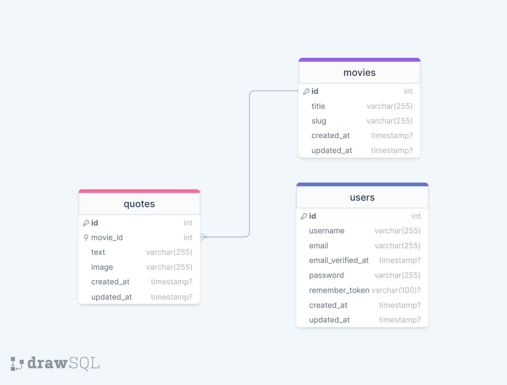

# Movie Quotes App

The Movie Quotes App is written in laravel 9, where the user 
gets random quote dedicated to a specific movie on refresh, additionally
the users can click on movie's title and they'll be taken to that
movie page which contains all qotes with its images for that movie.

Only admin has the ability to upload movies and quotes, admin can
be made with php artisan custom command - create:admin, and there is a
login page for admins only.

The app supports 2 languages, Georgian and English.

## Tech Stack

**Client:** HTML, TailwindCSS

**Server:** Laravel 9, Spatie Translatable Package.

## Database Structure
[Link to the diagram](https://drawsql.app/teams/gigi/diagrams/movie-quotes)

